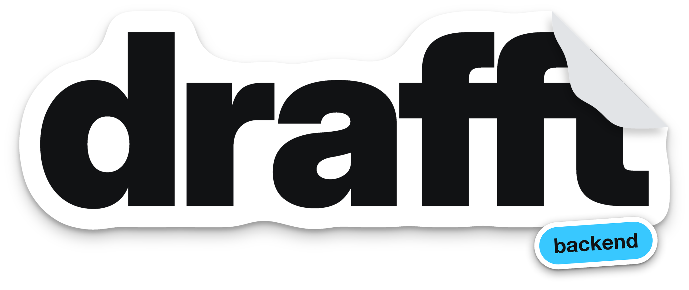
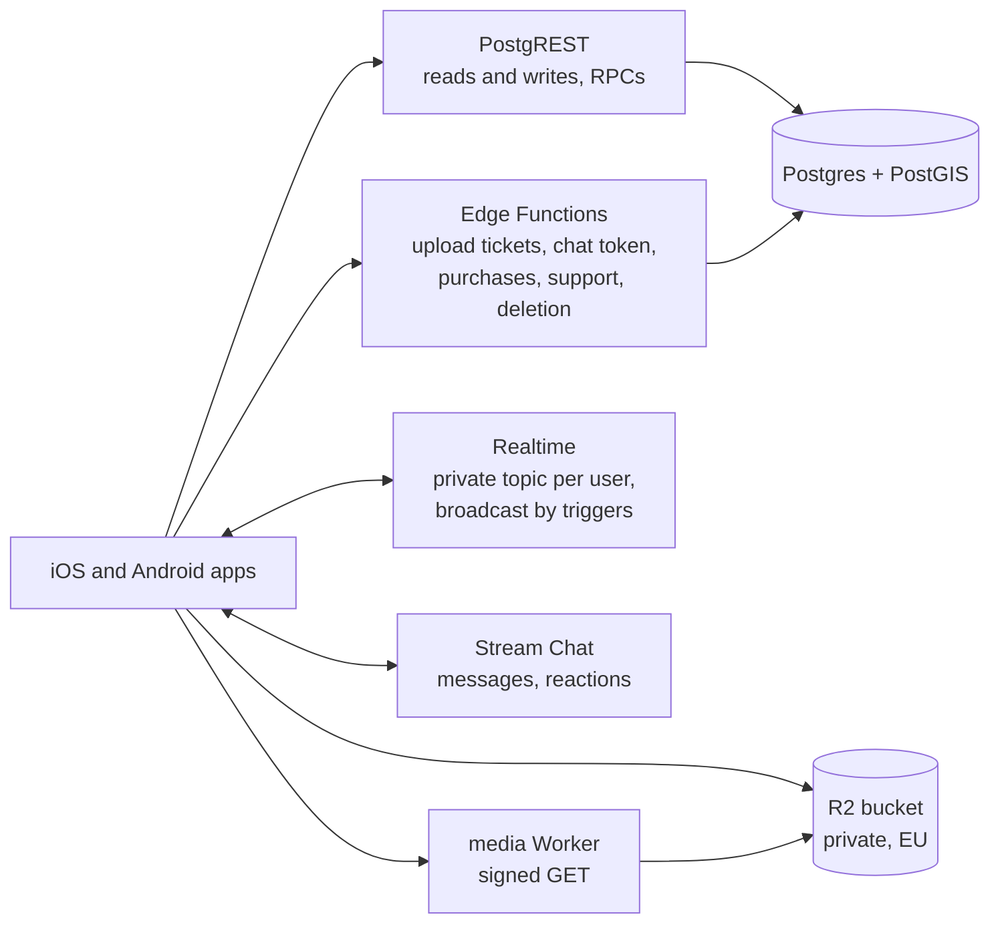
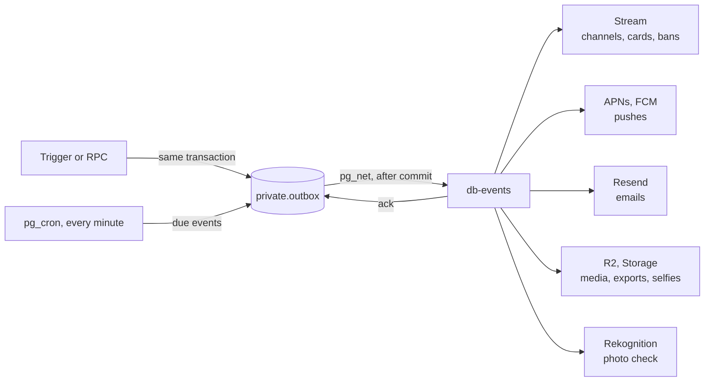

<div align="center">



The backend behind drafft, the dating app for people who train.<br>
Postgres, Auth, Realtime and Edge Functions on Supabase in the EU, media on Cloudflare R2, chat on Stream.

[](https://github.com/sylwaninn/drafft-backend/actions/workflows/backend.yml)
[](https://github.com/sylwaninn/drafft-backend/actions/workflows/drift.yml)


[How it works](#how-it-works) | [Getting started](#getting-started) | [Deploy](#environments-and-deploy) | [Docs](#documentation)

</div>

## What it does

One backend for the iPhone and Android apps and the team's dashboard (sophros):

- **Profiles and Discover:** sign-up, consent, profiles, the nearby deck, likes, matches, boosts.
- **Sessions:** proposals and answers between matched people, with reminders.
- **Chat:** one Stream channel per match, media checked after delivery, erased on schedule.
- **Purchases:** drafft tempo and packs through RevenueCat, credited once per transaction.
- **Safety:** moderation, holds and bans, selfie checks, reports, statements of reasons (DSA art. 17).
- **Support and privacy:** help requests by form and email, data export, account deletion, data retention.

## How it works

### The apps' traffic



- **Reads and writes.** A screen reads in one round trip: cards are denormalized on write (`profile_cards`),
  and `discover` returns a full batch. Clients read their own rows and update whitelisted profile columns;
  every other write is a `security definer` RPC that validates its input and answers a stable error code in
  `hint`. Signed out (`anon`), a client runs no database function: it reads `sports` and calls the public
  functions only. Contract: [docs/api.md](docs/api.md).
- **Edge Functions.** Each one checks the caller in code (`verify_jwt` is off): the signed-in user for the
  apps' calls (`media-upload-url`, `stream-token`, `chat-media`, `phone-code`, `purchase-sync`,
  `delete-account`, `device-check`), nobody for `app-config`, a Turnstile token for `support` when signed
  out, and a shared secret or a signature for the database's calls (`db-events`, `ops-alert`), Auth's hooks
  (`auth-email`, `auth-sms`), webhooks (`revenuecat-webhook`, `stream-webhook`) and the support mail Worker
  (`support-inbound`).
- **Live.** Triggers broadcast on the private topic `user:<id>`, which only its owner may join: `like`, `match`,
  `match_ended`, `session`, `media`, `wallet`, `profile`, `moderation`, `session_revoked`.
- **Privacy.** Locations are snapped to about 1 km on write, stay in the `private` schema and leave only as
  rounded distances or an area name. Birthdates never reach cards.

### Side effects: the outbox

Nothing calls a provider inside a transaction. Triggers and RPCs write the side effect to `private.outbox` in
the same transaction; after commit, `pg_net` posts it to the `db-events` function, which acks it when done.



| Mechanism | Rule |
|---|---|
| Retry | backoff of 30 s doubling up to 1 hour, with jitter (50 to 100 % of the delay) |
| Budget | 24 hours per event by default, shorter for pushes that would come too late (`private.outbox_policies`) |
| Circuit breakers | 5 failures in 2 minutes open a provider's circuit (Stream, APNs, FCM, Resend, Twilio, R2): its events wait without spending attempts; one probe after a minute, each failed probe doubling the wait up to 15 minutes |
| Idempotency | each handler records the steps it has done, so a retry runs only what's missing |
| Dead letter | an event out of budget stops; the team replays or discards it in sophros |
| Alerts | `ops-check` (pg_cron, every minute) opens an incident for failed or late events, an open circuit or a job behind; the `ops-alert` function emails the team once per incident, with one reminder after an hour and a daily summary |

### Media

1. `media-upload-url` checks the purpose, type and size and returns a presigned R2 PUT (10 minutes).
2. The app registers the file (`add_profile_media`, as a draft). `db-events` reads it from R2 and runs Rekognition
   (moderation labels, faces for photos): approved, refused, or left for the team.
3. A profile photo or video shows on a card only once approved and saved (`save_profile_media`); unsaved drafts
   go after 7 days. The voice intro isn't moderated: it reaches cards as soon as it's set.
4. Links are signed (HMAC-SHA256, 60 to 75 minutes) by the database, the Edge Functions and sophros, and served by
   the media Worker, which answers 404 to anything else. Smaller WebP copies are made once and kept in R2; in
   Likes, a free account sees blurred copies that name neither the person nor the photo. Details:
   [docs/media.md](docs/media.md).

### Chat and pushes

- **Chat.** `stream-token` gives the app a 24-hour token and creates its Stream user, banned while the account
  is on hold. `db-events` creates one channel per match (the match id) on `match.created`, posts the openers and
  the session cards into it, freezes it when the match ends and erases it a year later. Stream's webhook
  reports reactions to `stream-webhook`.
- **Pushes.** Stream pushes chat messages itself, to both apps (APNs providers `drafft-apn` and
  `drafft-apn-dev`, Firebase provider `drafft-fcm`). Everything else is sent by the backend through APNs
  (iPhone) or FCM (Android), chosen by each token's platform, in the person's language, within their
  notification settings; a push that would arrive too late is dropped.

### Purchases, auth, support

| Flow | Path |
|---|---|
| Purchases | RevenueCat's webhook (`revenuecat-webhook`) and the app's `purchase-sync` credit a pack once per store transaction and copy drafft tempo's expiry; every wallet change is a `wallet` event |
| Auth emails and SMS | Supabase Auth's hooks call `auth-email` (Resend) and `auth-sms` (Twilio) to send codes in the person's language; `phone-code` checks a number with Twilio Lookup first (mobile lines only) |
| Support by email | Cloudflare Email Routing hands each email to the support mail Worker, which files it into sophros through `support-inbound` ([docs/support.md](docs/support.md)) |
| Scheduled jobs | pg_cron: the outbox and alerts every minute, weekly boosts every 15 minutes, session reminders, and the nightly retention purges ([docs/privacy.md](docs/privacy.md)) |

### Built with

| Layer | Choice |
|---|---|
| Database | Postgres 17 + PostGIS on Supabase, pg_cron, pg_net, pgTAP tests |
| Functions | Deno Edge Functions, shared code in `supabase/functions/_shared/` |
| Media | Cloudflare R2 (EU jurisdiction), a Worker with the Images binding |
| Chat, pushes | Stream; APNs and FCM |
| Email, SMS | Resend; Twilio Messaging and Lookup |
| Purchases | RevenueCat |
| Safety | Amazon Rekognition, Apple DeviceCheck, Cloudflare Turnstile |

## Getting started

Needs Docker, the [Supabase CLI](https://supabase.com/docs/guides/cli) (`brew install supabase/tap/supabase`)
and [Deno](https://deno.com).

```sh
git config core.hooksPath .agents/git-hooks
supabase start                              # ports 55420-55429
deno run -A scripts/load-areas.ts local     # areas for area_at; again after a db reset
scripts/local-env.sh                        # once: functions/.env.local from staging's values
scripts/sync-vault.sh local                 # media signing secrets, so cards get photo links
supabase functions serve --env-file supabase/functions/.env.local
```

Then run `scripts/local-backend.sh` in drafft-ios or drafft-android to point the **Drafft Local** app at it.
Emails and SMS land in Mailpit (http://127.0.0.1:55424). Offline setup, real emails, local purchases:
[docs/local-development.md](docs/local-development.md).

### Checks

```sh
supabase test db                            # database tests (pgTAP)
deno fmt --check supabase/functions scripts cloudflare && deno lint supabase/functions scripts cloudflare
(cd supabase/functions && deno check ./*/index.ts && deno test --allow-env --allow-read=.,../../WORDING.md)
```

The full verify block is in [AGENTS.md](AGENTS.md#this-repository); CI adds the Workers' type checks and tests,
shellcheck, actionlint, gitleaks and the migration guard.

## Environments and deploy

| | Local | Staging | Production |
|---|---|---|---|
| Supabase | `supabase start` | persistent branch `staging` | project `wrcpgnqwjmnirjfxpcux` |
| Media | staging's bucket and Worker | `drafft-media-staging` | `drafft-media` |
| Deployed by | you | every merge into `staging` | a release (`v*` tag) |

| When | CI (`.github/workflows/backend.yml`) |
|---|---|
| Pull request | title; Deno format, lint, types and tests (functions, scripts, Workers), shellcheck, actionlint, gitleaks; pgTAP, schema lint, advisors; the migration guard |
| Merge into `staging` | the code and database checks, then `scripts/deploy.sh staging` (migrations, functions, areas), the media Worker, and the drift check |
| Release (**Actions > release**) | `main` fast-forwards to `staging`, a `vX.Y.Z` tag, then the same deploy to production |
| Every day | `drift.yml` compares the repository, staging and production |

CI never sets secrets or Auth settings, and never deploys the support mail Worker: those are done by hand,
always naming the project. Never deploy production by hand. Secrets, setup and rollback:
[docs/environments.md](docs/environments.md).

## Project layout

```text
supabase/
├── migrations/      schema, RPCs, triggers, jobs
├── functions/       Edge Functions; _shared/ holds email, push, erasure and export code
├── tests/           pgTAP
└── seed.sql         local Vault secrets and the dev staff account
cloudflare/
├── media-worker/            serves the private R2 bucket through signed links
└── support-mail-worker/     files emails to the support address into sophros
scripts/             deploy, Vault sync, Stream setup, App Store products (app-store-products.ts),
                     demo people, benchmark
docs/                reference (below)
```

## Documentation

| Document | Read it when you |
|---|---|
| [docs/api.md](docs/api.md) | call the backend from an app: RPCs, Realtime events, Edge Functions, errors |
| [docs/matching.md](docs/matching.md) | touch Discover, likes, boosts or pause; benchmark |
| [docs/media.md](docs/media.md) | touch uploads, signed links, smaller or blurred copies |
| [docs/moderation.md](docs/moderation.md) | add a sophros capability, a moderation decision or a staff read |
| [docs/support.md](docs/support.md) | touch support replies or the support email route |
| [docs/privacy.md](docs/privacy.md) | store new personal data: retention, erasure, export, deletion |
| [docs/environments.md](docs/environments.md) | set a secret, rebuild an environment, roll back |
| [docs/local-development.md](docs/local-development.md) | run the stack offline or test purchases locally |
| [docs/demo.md](docs/demo.md) | fill staging with demo people |
| [WORDING.md](WORDING.md) | write any email, push, SMS or notice people receive |
| [AGENTS.md](AGENTS.md) | run a coding agent, or need the repository rules |

## Related repositories

| Repository | Role |
|---|---|
| [drafft-ios](https://github.com/sylwaninn/drafft-ios) | iPhone app |
| [drafft-android](https://github.com/sylwaninn/drafft-android) | Android app |
| [drafft-web](https://github.com/sylwaninn/drafft-web) | getdrafft.com and the legal pages |
| [drafft-sophros](https://github.com/sylwaninn/drafft-sophros) | moderation and support dashboard |

## License

Proprietary. Copyright © 2026 the drafft authors. All rights reserved. No permission is granted to use, copy,
modify or distribute this code without written consent.
